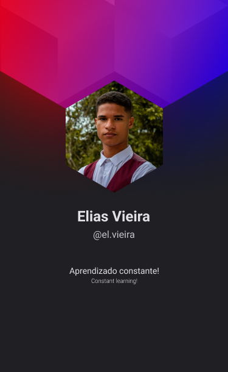

<h1 align="left">Olá! Eu sou o Elias Vieira!</h1>

 

  <a href="">
  
  

- 🔥 Aprendendo programação

- 📚 Estudando **HTML**, **CSS** e **JavaScript**

  

## 🛠 &nbsp;Tecnologias

&nbsp;
&nbsp;
&nbsp;
&nbsp;
&nbsp;
&nbsp;

## 👨🏽‍🦲 &nbsp;Redes Sociais
